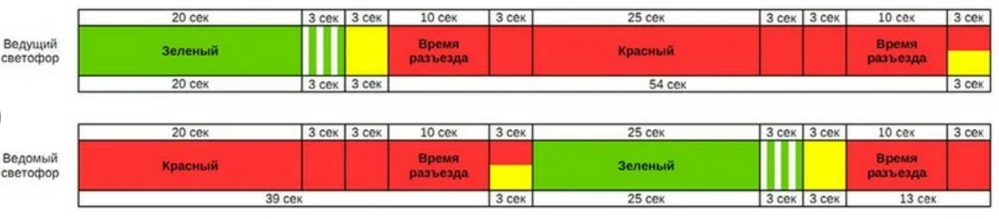
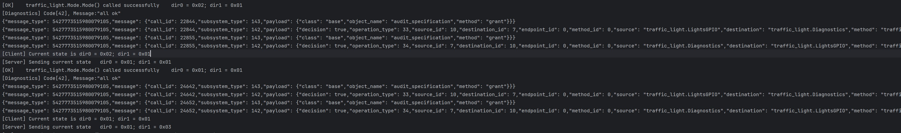

# Traffic lights control with KasperskyOS

English version will be available later below

## Описание для русскоязычной аудитории

### О примере

Это учебный проект, код следует использовать только в целях изучения особенностей разработки кибериммунных систем с использованием KasperskyOS.

Функционально пример представляет из себя заготовку системы управления для светофора. Предлагается реализовать несколько сущностей, описанных в архитектуре системы, а также реализовать политики безопасности, которые обеспечат работу системы согласно политике архитектуры.

Цели и предположения безопасности обсуждаются на онлайн-курсе (ссылка будет добавлена позже). 

Часть документации доступна в jupyter блокноте, находящемся в репозитории по ссылке https://github.com/cyberimmunity-edu/cyberimmune-systems-example-traffic-light-jupyter-notebook.

Всех, интересующихся кибериммунной разработкой и кибериммунной разработкой с использованием KasperskyOS приглашаем подписаться на наш телеграм-канал https://t.me/learning_cyberimmunity.  
В этом канале мы анонсируем набор в учебные группы, появление новых материалов, события, связанные с кибериммунной разработкой.

### Инструкция по настройке окружения для разработки

#### Системные требования
- Windows 10 или новее с установленным инструментом виртуализации (например, Oracle Virtual Box, Windows Subsystem for Linux - WSL) 
- Linux система (Debian или подобная лучше всего)
- работа примера с MacOS не проверялась, но с большой вероятностью запустить можно, используя Docker

- 8 или 16 ГБ ОЗУ для комфортной разработки (лучше, конечно, 32 ГБ, чтобы при необходимости параллельно использовать браузеры)
- 50, а лучше 100 ГБ свободного дискового пространства

С некоторыми ухищрениями учебный проект можно также запустить на бесплатных облачных ресурсах - в консоли Google Cloud, окружении Datalore Jetbrains.


#### Настройка системы

Пошаговая видео-инструкция по развёртыванию KasperskyOS в виртуальной машине под управлением Oracle VirtualBox доступна в составе этого курса: https://stepik.org/course/73418

Использование KasperskyOS в docker контейнере описано на этой странице: https://support.kaspersky.ru/help/KCE/1.1/ru-RU/using_docker.htm

### Сборка и запуск примера

* с использованием Makefile:
  *  <b>сборка docker образа с KasperskyOS</b>. 
  В этом проекте в качестве базового образа используется Ubuntu 20.04, при желании можно поменять на Ubuntu 22.04 или Debian 10.12.
    
        ```make d-build```   

        <i>Примечание</i>: установочный deb файл с KasperskyOS Community Edition SDK должен быть скопирован в папку с Dockerfile (корневую папку проекта) перед запуском этой команды

        
  *  <b>запуск контейнера</b>

        ```make develop```

        Примечание: в контейнере предполагается работать не от имени root, а от пользователя user. 
        
        Если где-то это будет мешать, нужно в Makefile для цели develop убрать в команде запуска аргумент "--user user"

        

  * <b> сборка проекта</b>. Примечание: эта команда должна выполняться внутри контейнера

    ```make build``` 

  * <b> запуск в qemu</b>. Примечание: эта команда должна выполняться внутри контейнера

    ```make sim``` 

  *  <b> удаление временных файлов</b>. Сейчас удаляет папку build со всем содержимым. 

        ```make clean``` 
    
        Собранный образ с SDK можно удалить командой 

        ```docker rmi kos:1.1.1.40u20.04```

## English version

Example: traffic light control (partial) implementation with KasperskyOS

Transformation of the echo example into the new project.

## Домашнее задание: День 3

Задание:

1. ✅  В примере «светофор» изменить/реализовать сущность Connector, интегрировать с имитатором сервера ГСУДД: сервер по запросу передаёт номер режима работы, connector должен его передать в систему управления; в системе управления режимы должны быть предварительно описаны. Ожидаемый результат: после запуска сервера и светофора появляется сообщение от системы управления о работе по заданному режиму. Примечание: взять за отправную точку код из fork-ов или пример из ветки example-networking.

2. ✅ Необязательное задание: Тесты функционала нового модуля Connector используя ATF (пары тестов достаточно). Библиотека есть в SDK. Её репозиторий - https://github.com/freebsd/atf

Ожидаемый результат: после запуска системы появляется сообщение от новой сущности

3. ✅  Необязательное задание повышенной сложности: вместо простого числа реализовать обработку режима в json формате и передачу в систему управления в виде структуры данных. Можно использовать сторонние библиотеки для разбора строки в json формате. Ожидаемый результат: после запуска сервера и светофора появляется сообщение от системы управления о работе по заданному режиму, в системе управления при этом режимы жёстко не прописываются. Примечание: для этого задания может быть полезным посмотреть код примера из SDK koslogger – как использовать статические библиотеки (в koslogger используется библиотека spdlog)

4. ✅ Отправить все свои изменения в свой репозиторий на github

## Решение
* Добавлено переключение режимов со стандартного на сервисный (мигающий желтый)
* Добавлена сущность `Connector`, которая получает статус от сервера ГСУДД, которое затем передается в `Control`. Для такого взаимодействия прописана политика безопасности проверяющая корректность установки режима: либо `0` - нормальный режим, либо `1` - сервисный. Передача других режимов не допустима.
* После окончания работы текущего цикла `Control` меняет режим работы светофора, соответствующий режиму в ГСУДД

## Для корректной работы
* Для корректной работы необходимо обеспечить сетевую доступность сервиса. При запуске на хосте `Windows` без wsl необходимо использовать текущий ipv4 адрес (можно посмотреть с помощью команды `ipconfig`)

## Пример схемы светофорного цикла



## Пример работы


